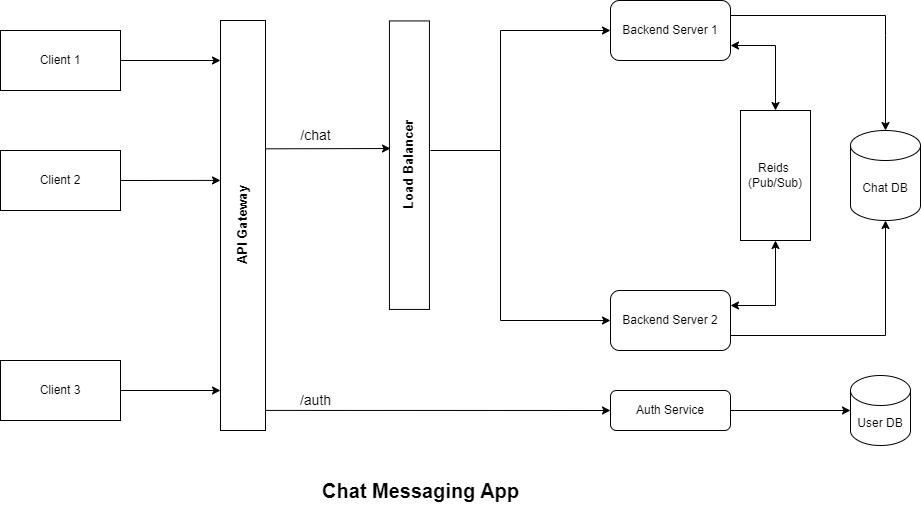

# Chat Messaging App

### Designed and Implemented a Chat Messaging Application where Users can send and receive real-time messages with their friends.

### Tech Stack Used

```
Next JS, Node JS, MongoDB, Redis, AWS, Docker,
```

## Architecture


### Functional Requirements
- Authentication: User Login, SignUp and Logout
- One to One Messaging
- Group Messaging
- Last Seen and Online/Offline Status
- Unread Messages

### Non Functional Requirements
- Availability
- Low Latency

### Microservices
- Auth Service
- Chat Backend Service

### Demo
